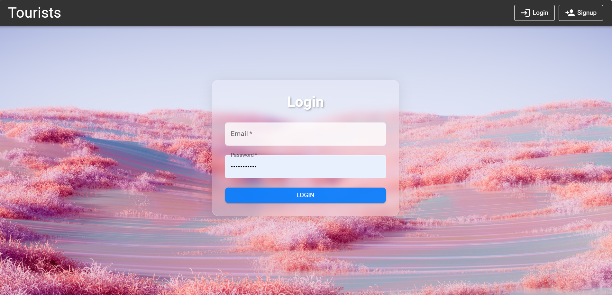

# 🌍 Tourism Platform

Welcome to **Tourism Platform**, an intelligent travel planning web application built with the MERN stack. Discover beautiful destinations, plan trips seamlessly, and get personalized travel guidance — all in one place!  

---

## ✨ Features

- **User Authentication**  
  Secure signup and login functionality to personalize user experience.

- **Dynamic Home Page**  
  Browse an extensive list of travel destinations, all fetched dynamically from a MongoDB database.

- **Interactive Google Maps Integration**  
  - Pinpoint and visualize each destination on Google Maps.
  - Explore nearby hotels and hospitals with a single click.
  - Get directions from your district to the chosen destination.

- **Location-based Travel Estimates**  
  The platform uses your real-time location data to:
  - Estimate travel time to your selected destination.
  - Suggest the best route options.

- **Weather Forecast Integration**  
  Get reliable weather forecasts for the next 3–4 days at your destination using a Weather API, helping you plan better.

- **AI-powered Travel Planner**  
  Generate detailed and customized travel itineraries with the help of **Gemini API**, making your trip planning stress-free and personalized.

---

## 🚀 Technologies Used

- **Frontend**: React.js
- **Backend**: Node.js, Express.js
- **Database**: MongoDB
- **Maps**: Google Maps API
- **Weather**: Weather API (e.g., OpenWeather)
- **AI Planning**: Gemini API
- **Authentication**: JWT and bcrypt

---

## 💡 Getting Started

### Prerequisites

- Node.js
- MongoDB
- Google Maps API key
- Weather API key
- Gemini API key

## 📸 Screenshots

